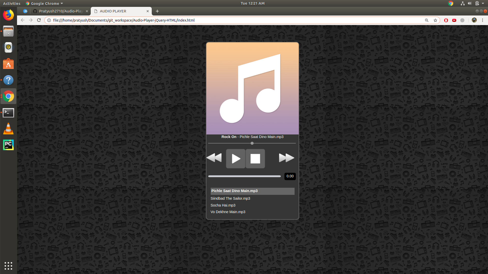

# Audio-Player-jQuery-HTML
A simple audio player in JQuery and HTML. 
Static for now, you need to manually put in songs in index.html and media directory and enjoy all the features of the audio player.

